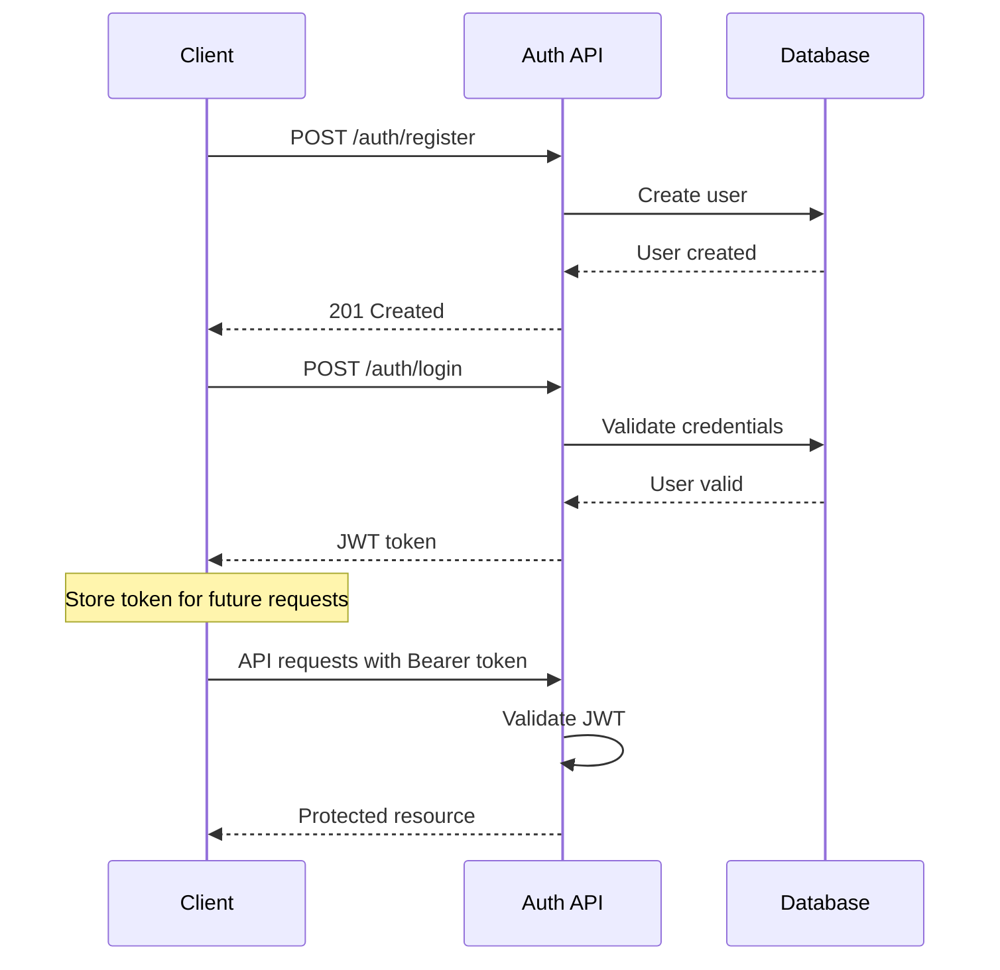

# Echoforge API Documentation

This directory contains comprehensive API documentation for the Echoforge multi-tenant platform.

## 📁 Contents

- `openapi.yaml` - Complete OpenAPI 3.0 specification (22KB+)
- `postman-collection.json` - Postman collection with all endpoints
- Interactive examples and test scenarios

## 🚀 Quick Start

### Option 1: Postman Collection (Recommended)

1. **Import Collection**: Import `postman-collection.json` into Postman
2. **Set Variables**: Configure collection variables:
   - `baseUrl`: `http://localhost:8080` (or your server URL)
   - `siteId`: Your site identifier (e.g., `my-blog`, `manga-site`)
3. **Test Authentication**: Run "Login User" to auto-populate JWT token
4. **Explore Endpoints**: All requests are pre-configured with proper headers

### Option 2: OpenAPI Specification

1. **View Online**: Paste `openapi.yaml` into [Swagger Editor](https://editor.swagger.io/)
2. **Generate Client**: Use OpenAPI generators for your language
3. **Interactive Docs**: Deploy with Swagger UI for team documentation

## 🔧 Configuration

### Environment Variables
```bash
# Set in your environment or Postman
BASE_URL=http://localhost:8080
SITE_ID=your-site-id
JWT_TOKEN=your-jwt-token-here
```

### Required Headers
All API requests require:
```http
X-Site-ID: your-site-id
Authorization: Bearer <jwt-token>  # For protected endpoints
Content-Type: application/json     # For POST/PUT requests
```

## 📊 API Overview

| Endpoint Group | Endpoints | Description |
|---------------|-----------|-------------|
| **Authentication** | 3 | Register, login, logout |
| **Blog Management** | 6 | CRUD + search for blog posts |
| **Portfolio** | 5 | CRUD for portfolio projects |
| **File Management** | 3 | Upload, retrieve, delete files |
| **Categories & Tags** | 4 | Manage content organization |
| **System** | 2 | Health checks and API info |

## 🏗️ Multi-Tenant Architecture

Echoforge supports multiple sites with isolated data:

### Site Types
- **Blog Site**: Content management with posts, categories, tags
- **Portfolio Site**: Project showcases with rich metadata
- **Manga Site**: Chapter-based content with series management
- **Custom Sites**: Extensible for any use case

### Site Isolation
- Each request must include `X-Site-ID` header
- Data is automatically filtered by site
- No cross-site data leakage

## 🔐 Authentication Flow



## 📝 Example Workflows

### Creating a Blog Post
```bash
# 1. Login and get token
curl -X POST http://localhost:8080/api/v1/auth/login \
  -H "Content-Type: application/json" \
  -H "X-Site-ID: my-blog" \
  -d '{"email": "admin@blog.com", "password": "secure123"}'

# 2. Create blog post with token
curl -X POST http://localhost:8080/api/v1/posts \
  -H "Content-Type: application/json" \
  -H "X-Site-ID: my-blog" \
  -H "Authorization: Bearer <token>" \
  -d '{
    "title": "My First Post",
    "content": "Hello world!",
    "status": "published",
    "tags": ["intro", "blog"]
  }'
```

### Portfolio Project Management
```bash
# Create portfolio project
curl -X POST http://localhost:8080/api/v1/portfolio \
  -H "Content-Type: application/json" \
  -H "X-Site-ID: my-portfolio" \
  -H "Authorization: Bearer <token>" \
  -d '{
    "title": "E-commerce Platform",
    "content": "Full-stack solution...",
    "metadata": {
      "demo_url": "https://demo.example.com",
      "github_url": "https://github.com/user/project",
      "technologies": ["React", "Node.js", "MongoDB"]
    }
  }'
```

## 🧪 Testing with Postman

### Collection Features
- **Auto-authentication**: Login automatically saves JWT token
- **Environment variables**: Easy switching between dev/prod
- **Request examples**: Pre-filled with realistic data
- **Test scripts**: Automated validation of responses

### Test Scenarios
1. **User Registration Flow**
2. **Content Creation & Management**
3. **File Upload & Retrieval**
4. **Search & Filtering**
5. **Error Handling**

## 🔍 Error Handling

### Standard Error Response
```json
{
  "error": {
    "code": "VALIDATION_ERROR",
    "message": "Invalid input data",
    "details": {
      "field": "email",
      "issue": "must be valid email format"
    }
  }
}
```

### Common HTTP Status Codes
- `200` - Success
- `201` - Created
- `400` - Bad Request (validation errors)
- `401` - Unauthorized (invalid/missing token)
- `403` - Forbidden (insufficient permissions)
- `404` - Not Found
- `429` - Rate Limited
- `500` - Internal Server Error

## 🚀 Integration Examples

### JavaScript/Node.js
```javascript
const API_BASE = 'http://localhost:8080/api/v1';
const SITE_ID = 'my-blog';

// Login and store token
async function login(email, password) {
  const response = await fetch(`${API_BASE}/auth/login`, {
    method: 'POST',
    headers: {
      'Content-Type': 'application/json',
      'X-Site-ID': SITE_ID,
    },
    body: JSON.stringify({ email, password }),
  });
  
  const data = await response.json();
  localStorage.setItem('jwt_token', data.token);
  return data.token;
}

// Create blog post
async function createPost(title, content) {
  const token = localStorage.getItem('jwt_token');
  const response = await fetch(`${API_BASE}/posts`, {
    method: 'POST',
    headers: {
      'Content-Type': 'application/json',
      'X-Site-ID': SITE_ID,
      'Authorization': `Bearer ${token}`,
    },
    body: JSON.stringify({ title, content, status: 'published' }),
  });
  
  return response.json();
}
```

### Python
```python
import requests

API_BASE = 'http://localhost:8080/api/v1'
SITE_ID = 'my-blog'

class EchoforgeAPI:
    def __init__(self, site_id):
        self.site_id = site_id
        self.token = None
        self.headers = {
            'Content-Type': 'application/json',
            'X-Site-ID': site_id,
        }
    
    def login(self, email, password):
        response = requests.post(f'{API_BASE}/auth/login', 
            headers=self.headers,
            json={'email': email, 'password': password}
        )
        
        data = response.json()
        self.token = data['token']
        self.headers['Authorization'] = f'Bearer {self.token}'
        return data
    
    def create_post(self, title, content, **kwargs):
        return requests.post(f'{API_BASE}/posts',
            headers=self.headers,
            json={'title': title, 'content': content, **kwargs}
        ).json()

# Usage
api = EchoforgeAPI('my-blog')
api.login('admin@blog.com', 'secure123')
post = api.create_post('My Post', 'Hello world!', status='published')
```

## 📚 Additional Resources

- **Architecture Docs**: `../architecture/` - System design and data flow
- **Site Guides**: `../guides/site-extension/` - Setup guides for different site types
- **OpenAPI Spec**: Use with code generators for client libraries
- **Postman Collection**: Import for immediate API testing

## 🆘 Support

For API issues or questions:
1. Check error response messages
2. Verify required headers are included
3. Ensure site_id matches your configuration
4. Review authentication token validity
5. Consult site-specific guides for custom implementations