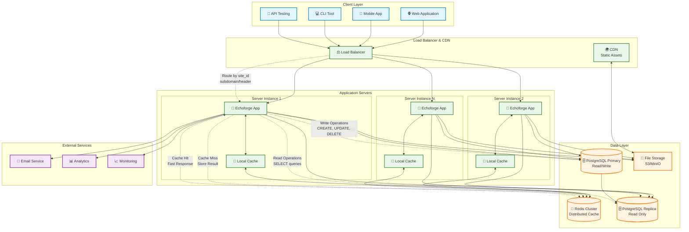
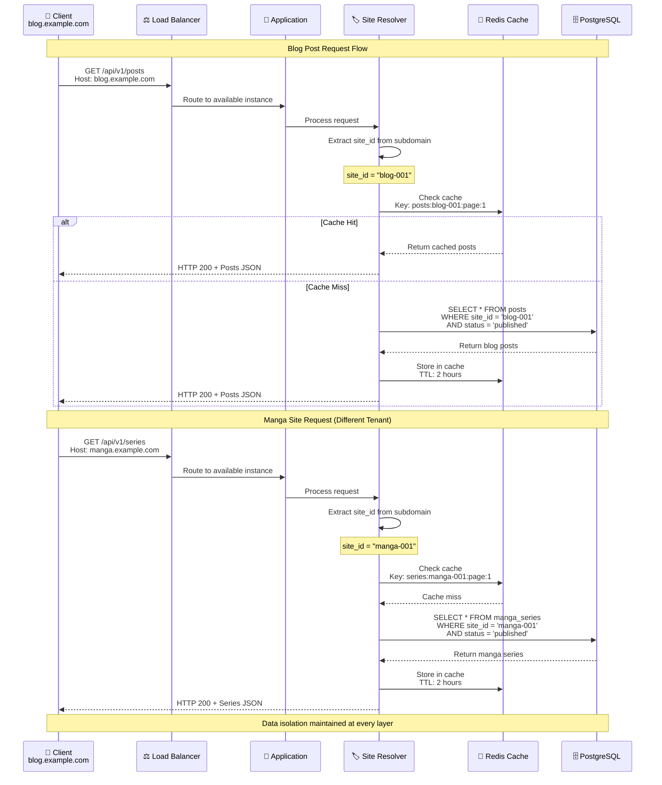
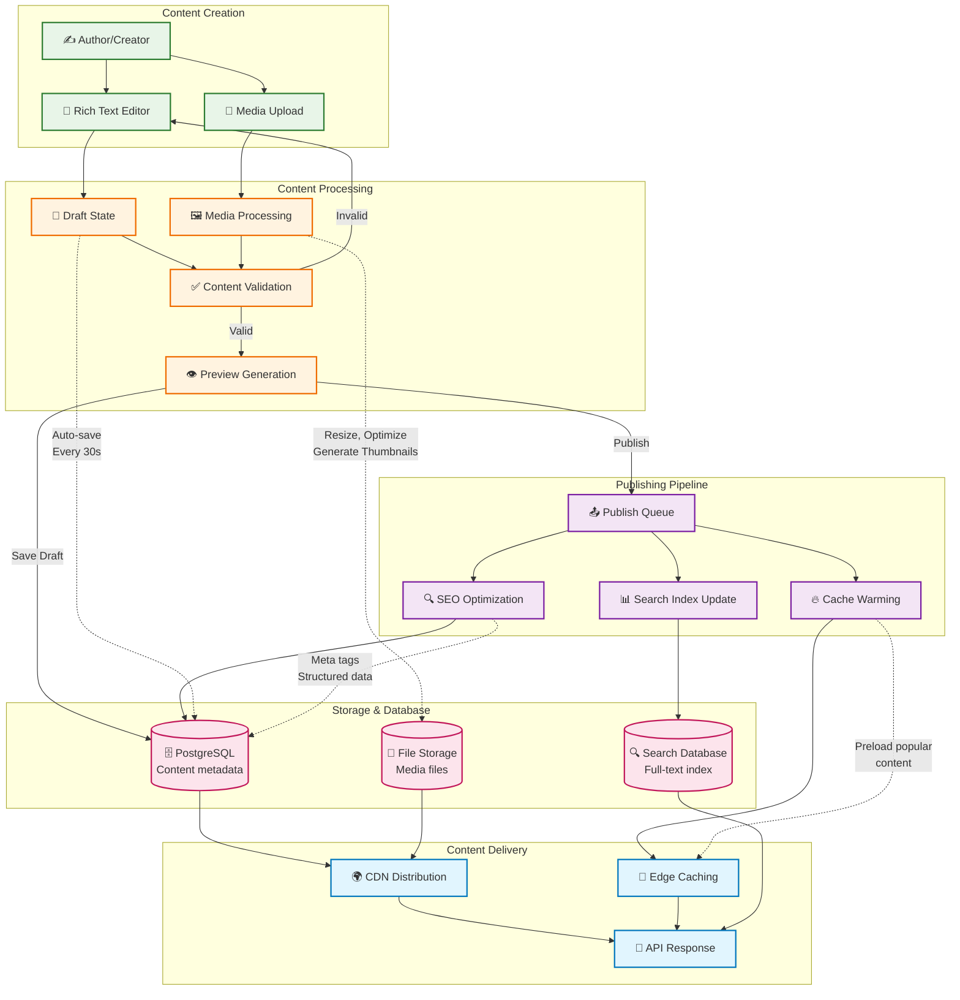
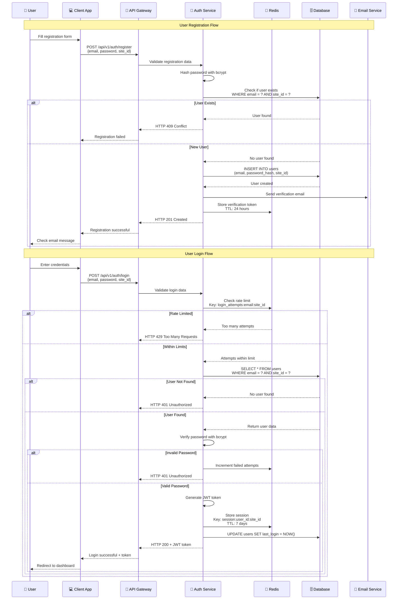
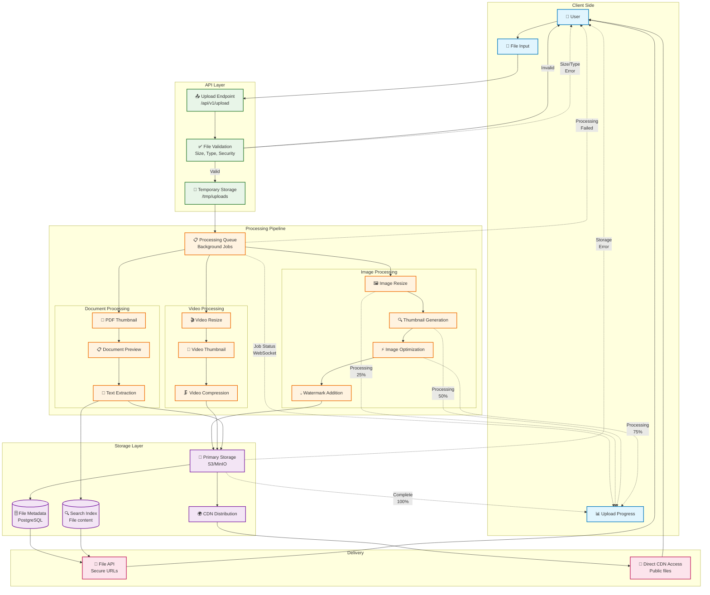
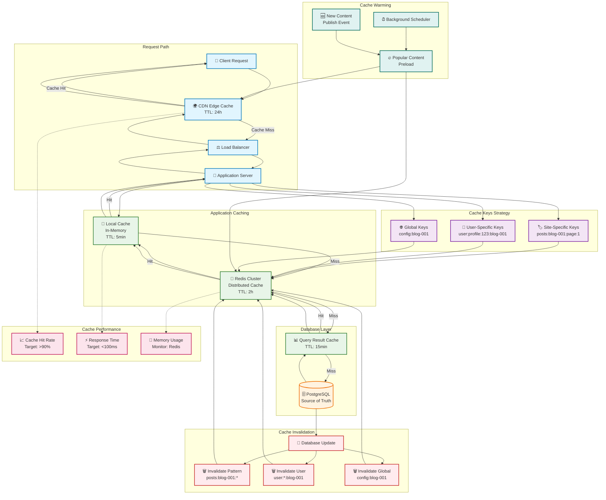
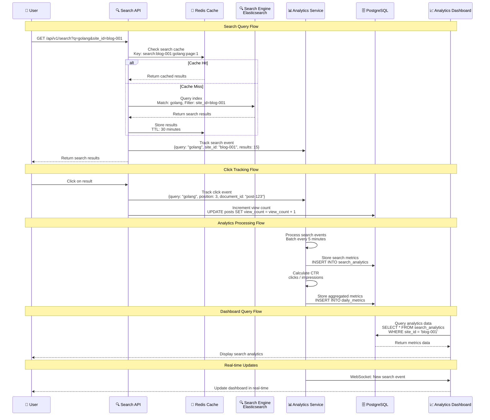

# Data Flow Diagrams

This document illustrates how data flows through Echoforge's multi-tenant architecture for different site types and operations.

## Overall System Data Flow

This high-level diagram shows the complete data journey from client request to database response:

## Multi-Tenant Request Flow

This diagram shows how site-specific data is isolated and processed:

## Content Publishing Flow

This diagram illustrates how content moves through the publishing pipeline:

## User Authentication Flow

This diagram shows how authentication data flows through the system:

## File Upload and Processing Flow

This diagram shows how media files are processed and stored:

## Caching Strategy Flow

This diagram illustrates the multi-level caching architecture:

## Search and Analytics Data Flow

This diagram shows how search queries and analytics data flow through the system:

These data flow diagrams provide a comprehensive view of how information moves through Echoforge's architecture, from simple request-response cycles to complex content processing pipelines and real-time analytics systems. Each diagram emphasizes the multi-tenant nature of the platform and how data isolation is maintained throughout all operations.