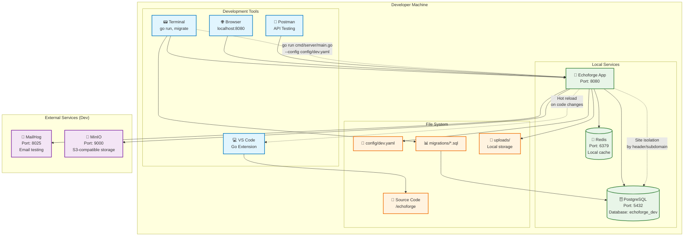
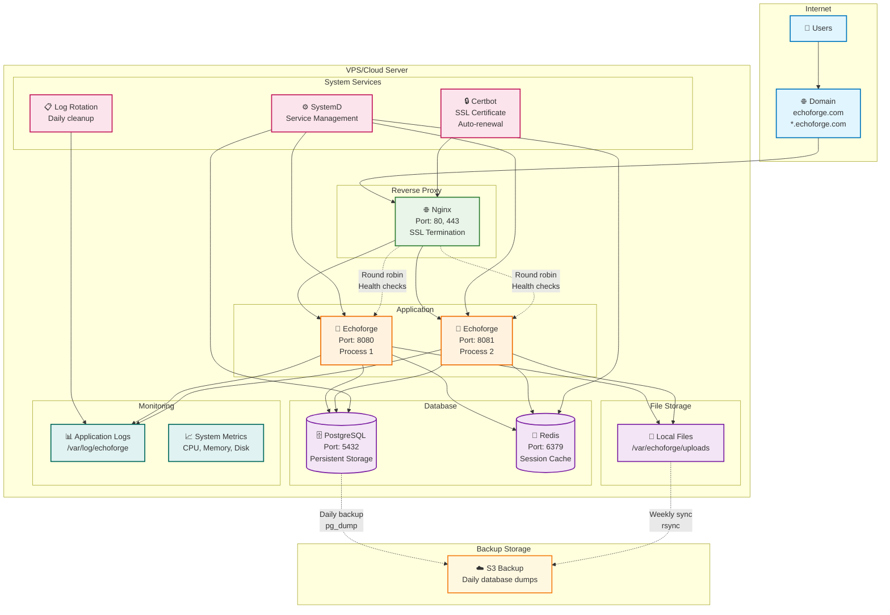
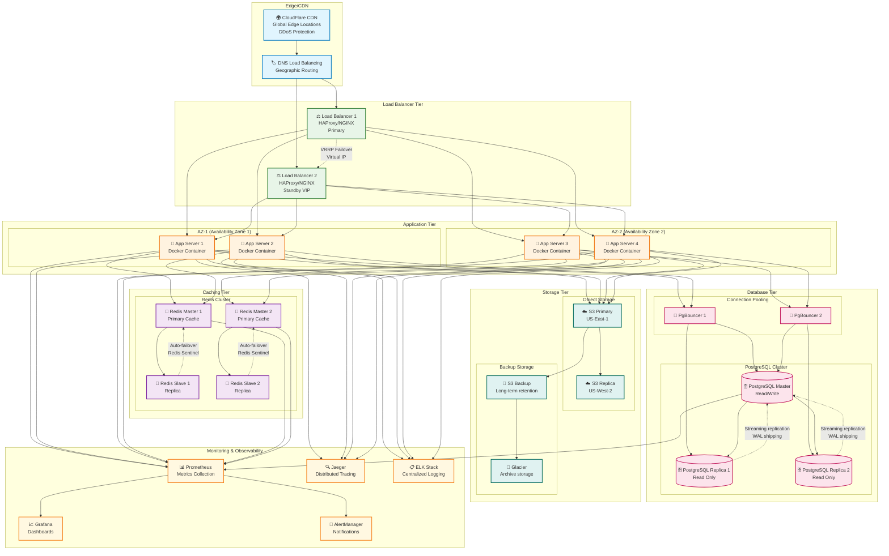

# Deployment Architecture

This document provides comprehensive deployment diagrams for Echoforge, covering everything from development environments to production-scale deployments with high availability and multi-region setups.

## Development Environment

This diagram shows the local development setup:

## Single Server Deployment

This diagram shows a simple single-server production deployment:

## High Availability Deployment

This diagram shows a production-ready HA deployment:

## Kubernetes Deployment

This diagram shows a cloud-native Kubernetes deployment:

```mermaid
flowchart TB
    subgraph "External Load Balancer"
        AWS_ALB[⚖️ AWS ALB<br/>Application Load Balancer<br/>SSL Termination]
    end
    
    subgraph "Kubernetes Cluster"
        subgraph "Ingress"
            IngressController[🌐 NGINX Ingress<br/>Path-based routing<br/>Rate limiting]
        end
        
        subgraph "Application Namespace"
            subgraph "Echoforge Deployment"
                EchoforgePod1[🚀 Echoforge Pod 1<br/>App + Sidecar]
                EchoforgePod2[🚀 Echoforge Pod 2<br/>App + Sidecar]
                EchoforgePod3[🚀 Echoforge Pod 3<br/>App + Sidecar]
            end
            
            EchoforgeService[⚖️ Echoforge Service<br/>LoadBalancer<br/>Port: 8080]
            EchoforgeHPA[📈 Horizontal Pod Autoscaler<br/>CPU/Memory based]
        end
        
        subgraph "Cache Namespace"
            subgraph "Redis Deployment"
                RedisMaster[🔄 Redis Master<br/>StatefulSet]
                RedisSlave1[🔄 Redis Replica 1<br/>StatefulSet]
                RedisSlave2[🔄 Redis Replica 2<br/>StatefulSet]
            end
            
            RedisService[⚖️ Redis Service<br/>ClusterIP<br/>Port: 6379]
            RedisPVC[💾 Redis PVC<br/>Persistent Storage]
        end
        
        subgraph "Database Namespace"
            subgraph "PostgreSQL Deployment"
                PostgresPrimary[(🗄️ PostgreSQL Primary<br/>StatefulSet)]
                PostgresReplica1[(🗄️ PostgreSQL Replica 1<br/>StatefulSet)]
                PostgresReplica2[(🗄️ PostgreSQL Replica 2<br/>StatefulSet)]
            end
            
            PostgresService[⚖️ PostgreSQL Service<br/>ClusterIP<br/>Port: 5432]
            PostgresPVC[💾 PostgreSQL PVC<br/>Persistent Storage]
        end
        
        subgraph "Monitoring Namespace"
            Prometheus[📊 Prometheus<br/>Deployment]
            Grafana[📈 Grafana<br/>Deployment]
            AlertManager[🚨 AlertManager<br/>Deployment]
        end
        
        subgraph "System Namespace"
            MetricsServer[📊 Metrics Server<br/>Resource monitoring]
            ClusterAutoscaler[🔄 Cluster Autoscaler<br/>Node scaling]
        end
    end
    
    subgraph "External Services"
        RDS[(☁️ AWS RDS<br/>PostgreSQL<br/>Managed database)]
        ElastiCache[(🔄 AWS ElastiCache<br/>Redis<br/>Managed cache)]
        S3[(📁 AWS S3<br/>Object storage)]
        SES[📧 AWS SES<br/>Email service]
    end
    
    subgraph "CI/CD Pipeline"
        GitHub[📁 GitHub<br/>Source code]
        GitHubActions[🔄 GitHub Actions<br/>CI/CD pipeline]
        ECR[📦 AWS ECR<br/>Container registry]
        ArgoCD[🚀 ArgoCD<br/>GitOps deployment]
    end
    
    %% Traffic Flow
    AWS_ALB --> IngressController
    IngressController --> EchoforgeService
    EchoforgeService --> EchoforgePod1
    EchoforgeService --> EchoforgePod2
    EchoforgeService --> EchoforgePod3
    
    %% Internal Services
    EchoforgePod1 --> RedisService
    EchoforgePod2 --> RedisService
    EchoforgePod3 --> RedisService
    
    EchoforgePod1 --> PostgresService
    EchoforgePod2 --> PostgresService
    EchoforgePod3 --> PostgresService
    
    RedisService --> RedisMaster
    RedisService --> RedisSlave1
    RedisService --> RedisSlave2
    
    PostgresService --> PostgresPrimary
    PostgresService --> PostgresReplica1
    PostgresService --> PostgresReplica2
    
    %% External Services (Alternative)
    EchoforgePod1 -.-> RDS
    EchoforgePod1 -.-> ElastiCache
    EchoforgePod1 --> S3
    EchoforgePod1 --> SES
    
    %% Persistent Storage
    RedisMaster --> RedisPVC
    RedisSlave1 --> RedisPVC
    RedisSlave2 --> RedisPVC
    
    PostgresPrimary --> PostgresPVC
    PostgresReplica1 --> PostgresPVC
    PostgresReplica2 --> PostgresPVC
    
    %% Autoscaling
    EchoforgeHPA --> EchoforgePod1
    EchoforgeHPA --> EchoforgePod2
    EchoforgeHPA --> EchoforgePod3
    
    MetricsServer --> EchoforgeHPA
    ClusterAutoscaler --> MetricsServer
    
    %% Monitoring
    Prometheus --> EchoforgePod1
    Prometheus --> EchoforgePod2
    Prometheus --> EchoforgePod3
    Prometheus --> RedisMaster
    Prometheus --> PostgresPrimary
    
    Grafana --> Prometheus
    AlertManager --> Prometheus
    
    %% CI/CD Flow
    GitHub --> GitHubActions
    GitHubActions --> ECR
    ECR --> ArgoCD
    ArgoCD --> EchoforgePod1
    ArgoCD --> EchoforgePod2
    ArgoCD --> EchoforgePod3
    
    %% Styling
    classDef lb fill:#e1f5fe,stroke:#0277bd,stroke-width:2px
    classDef ingress fill:#e8f5e8,stroke:#2e7d32,stroke-width:2px
    classDef app fill:#fff3e0,stroke:#ef6c00,stroke-width:2px
    classDef service fill:#f3e5f5,stroke:#7b1fa2,stroke-width:2px
    classDef cache fill:#fce4ec,stroke:#c2185b,stroke-width:2px
    classDef database fill:#e0f2f1,stroke:#00695c,stroke-width:2px
    classDef monitoring fill:#fff8e1,stroke:#f57f17,stroke-width:2px
    classDef external fill:#f1f8e9,stroke:#33691e,stroke-width:2px
    classDef cicd fill:#fce4ec,stroke:#ad1457,stroke-width:2px
    
    class AWS_ALB lb
    class IngressController ingress
    class EchoforgePod1,EchoforgePod2,EchoforgePod3,EchoforgeHPA app
    class EchoforgeService,RedisService,PostgresService service
    class RedisMaster,RedisSlave1,RedisSlave2,ElastiCache cache
    class PostgresPrimary,PostgresReplica1,PostgresReplica2,RDS database
    class Prometheus,Grafana,AlertManager,MetricsServer,ClusterAutoscaler monitoring
    class S3,SES external
    class GitHub,GitHubActions,ECR,ArgoCD cicd
```

## Multi-Region Deployment

This diagram shows a global multi-region deployment:

```mermaid
flowchart TB
    subgraph "Global DNS & CDN"
        Route53[🌍 Route53<br/>Global DNS<br/>Health-based routing]
        CloudFront[🌍 CloudFront CDN<br/>Global edge locations<br/>Static content delivery]
    end
    
    subgraph "US-East-1 (Primary Region)"
        subgraph "US-East-1 Infrastructure"
            ALB_US_East[⚖️ ALB US-East<br/>Primary load balancer]
            
            subgraph "US-East-1 Compute"
                EKS_US_East[☸️ EKS Cluster US-East<br/>3 AZs, Auto-scaling]
                App_US_East[🚀 Echoforge Pods<br/>3-9 replicas]
            end
            
            subgraph "US-East-1 Data"
                RDS_US_East_Primary[(🗄️ RDS Primary<br/>Multi-AZ deployment)]
                RDS_US_East_Read[(🗄️ RDS Read Replica<br/>Cross-AZ)]
                ElastiCache_US_East[🔄 ElastiCache<br/>Redis cluster]
                S3_US_East[📁 S3 US-East<br/>Primary storage]
            end
        end
    end
    
    subgraph "US-West-2 (Secondary Region)"
        subgraph "US-West-2 Infrastructure"
            ALB_US_West[⚖️ ALB US-West<br/>Secondary load balancer]
            
            subgraph "US-West-2 Compute"
                EKS_US_West[☸️ EKS Cluster US-West<br/>3 AZs, Auto-scaling]
                App_US_West[🚀 Echoforge Pods<br/>3-6 replicas]
            end
            
            subgraph "US-West-2 Data"
                RDS_US_West_Replica[(🗄️ RDS Cross-Region<br/>Read replica)]
                ElastiCache_US_West[🔄 ElastiCache<br/>Redis cluster]
                S3_US_West[📁 S3 US-West<br/>Cross-region replication]
            end
        end
    end
    
    subgraph "EU-West-1 (European Region)"
        subgraph "EU-West-1 Infrastructure"
            ALB_EU[⚖️ ALB EU-West<br/>European load balancer]
            
            subgraph "EU-West-1 Compute"
                EKS_EU[☸️ EKS Cluster EU-West<br/>3 AZs, Auto-scaling]
                App_EU[🚀 Echoforge Pods<br/>3-6 replicas]
            end
            
            subgraph "EU-West-1 Data"
                RDS_EU_Replica[(🗄️ RDS Cross-Region<br/>Read replica)]
                ElastiCache_EU[🔄 ElastiCache<br/>Redis cluster]
                S3_EU[📁 S3 EU-West<br/>Cross-region replication]
            end
        end
    end
    
    subgraph "Global Monitoring & Management"
        CloudWatch[📊 CloudWatch<br/>Global metrics & logs]
        XRay[🔍 X-Ray<br/>Distributed tracing]
        Config[⚙️ AWS Config<br/>Compliance monitoring]
        
        subgraph "Disaster Recovery"
            Backup_Global[💾 Global Backup<br/>Cross-region snapshots]
            DR_Automation[🤖 DR Automation<br/>Failover scripts]
        end
    end
    
    subgraph "Data Replication"
        DatabaseReplication[🔄 Database Replication<br/>Async cross-region]
        StorageReplication[🔄 Storage Replication<br/>S3 cross-region sync]
        CacheReplication[🔄 Cache Invalidation<br/>Global cache sync]
    end
    
    %% Global Routing
    Route53 --> CloudFront
    Route53 --> ALB_US_East
    Route53 --> ALB_US_West
    Route53 --> ALB_EU
    
    CloudFront --> S3_US_East
    CloudFront --> S3_US_West
    CloudFront --> S3_EU
    
    %% Region Traffic Flow
    ALB_US_East --> EKS_US_East
    EKS_US_East --> App_US_East
    
    ALB_US_West --> EKS_US_West
    EKS_US_West --> App_US_West
    
    ALB_EU --> EKS_EU
    EKS_EU --> App_EU
    
    %% Regional Data Access
    App_US_East --> RDS_US_East_Primary
    App_US_East --> RDS_US_East_Read
    App_US_East --> ElastiCache_US_East
    App_US_East --> S3_US_East
    
    App_US_West --> RDS_US_West_Replica
    App_US_West --> ElastiCache_US_West
    App_US_West --> S3_US_West
    
    App_EU --> RDS_EU_Replica
    App_EU --> ElastiCache_EU
    App_EU --> S3_EU
    
    %% Cross-Region Replication
    RDS_US_East_Primary --> RDS_US_West_Replica
    RDS_US_East_Primary --> RDS_EU_Replica
    
    S3_US_East --> S3_US_West
    S3_US_East --> S3_EU
    
    ElastiCache_US_East --> CacheReplication
    CacheReplication --> ElastiCache_US_West
    CacheReplication --> ElastiCache_EU
    
    %% Monitoring
    App_US_East --> CloudWatch
    App_US_West --> CloudWatch
    App_EU --> CloudWatch
    
    App_US_East --> XRay
    App_US_West --> XRay
    App_EU --> XRay
    
    %% Disaster Recovery
    RDS_US_East_Primary --> Backup_Global
    S3_US_East --> Backup_Global
    
    DR_Automation --> ALB_US_West
    DR_Automation --> ALB_EU
    
    %% Health Checks & Failover
    Route53 -.->|"Health check<br/>Primary: US-East"| ALB_US_East
    Route53 -.->|"Failover target<br/>Secondary: US-West"| ALB_US_West
    Route53 -.->|"Geographic routing<br/>Europe: EU-West"| ALB_EU
    
    DatabaseReplication -.->|"WAL shipping<br/>5-10 second lag"| RDS_US_West_Replica
    StorageReplication -.->|"S3 Cross-Region<br/>~15 minute sync"| S3_US_West
    
    %% Styling
    classDef global fill:#e1f5fe,stroke:#0277bd,stroke-width:3px
    classDef primary fill:#e8f5e8,stroke:#2e7d32,stroke-width:3px
    classDef secondary fill:#fff3e0,stroke:#ef6c00,stroke-width:2px
    classDef europe fill:#f3e5f5,stroke:#7b1fa2,stroke-width:2px
    classDef monitoring fill:#fce4ec,stroke:#c2185b,stroke-width:2px
    classDef replication fill:#e0f2f1,stroke:#00695c,stroke-width:2px
    
    class Route53,CloudFront global
    class ALB_US_East,EKS_US_East,App_US_East,RDS_US_East_Primary,RDS_US_East_Read,ElastiCache_US_East,S3_US_East primary
    class ALB_US_West,EKS_US_West,App_US_West,RDS_US_West_Replica,ElastiCache_US_West,S3_US_West secondary
    class ALB_EU,EKS_EU,App_EU,RDS_EU_Replica,ElastiCache_EU,S3_EU europe
    class CloudWatch,XRay,Config,Backup_Global,DR_Automation monitoring
    class DatabaseReplication,StorageReplication,CacheReplication replication
```

## Docker Compose Development Stack

This diagram shows the complete Docker development environment:

```mermaid
graph TB
    subgraph "Docker Compose Stack"
        subgraph "Application Services"
            EchoforgeApp[🚀 echoforge-app<br/>Port: 8080<br/>Go application]
            EchoforgeWorker[⚙️ echoforge-worker<br/>Background jobs<br/>Same image, different cmd]
        end
        
        subgraph "Database Services"
            PostgresDB[(🗄️ postgres<br/>Port: 5432<br/>Database: echoforge)]
            RedisCache[(🔄 redis<br/>Port: 6379<br/>Cache & sessions)]
        end
        
        subgraph "Storage Services"
            MinIOStorage[📁 minio<br/>Port: 9000, 9001<br/>S3-compatible storage]
        end
        
        subgraph "Communication Services"
            MailHogEmail[📧 mailhog<br/>Port: 1025, 8025<br/>Email testing]
        end
        
        subgraph "Monitoring Services"
            PrometheusMetrics[📊 prometheus<br/>Port: 9090<br/>Metrics collection]
            GrafanaDashboard[📈 grafana<br/>Port: 3000<br/>Metrics visualization]
        end
        
        subgraph "Development Tools"
            Adminer[🗄️ adminer<br/>Port: 8081<br/>Database admin]
            RedisCommander[🔄 redis-commander<br/>Port: 8082<br/>Redis admin]
        end
        
        subgraph "Shared Volumes"
            PostgresData[💾 postgres_data<br/>Database persistence]
            RedisData[💾 redis_data<br/>Cache persistence]
            MinIOData[💾 minio_data<br/>File storage]
            AppLogs[📋 app_logs<br/>Application logs]
        end
        
        subgraph "Docker Networks"
            EchoforgeNetwork[🌐 echoforge-network<br/>Internal communication]
        end
    end
    
    subgraph "Host System"
        Developer[👨‍💻 Developer<br/>Local machine]
        HostFileSystem[📁 Host File System<br/>Source code, configs]
        DockerEngine[🐳 Docker Engine<br/>Container runtime]
    end
    
    %% Service Dependencies
    EchoforgeApp --> PostgresDB
    EchoforgeApp --> RedisCache
    EchoforgeApp --> MinIOStorage
    EchoforgeApp --> MailHogEmail
    
    EchoforgeWorker --> PostgresDB
    EchoforgeWorker --> RedisCache
    EchoforgeWorker --> MinIOStorage
    EchoforgeWorker --> MailHogEmail
    
    %% Admin Tools
    Adminer --> PostgresDB
    RedisCommander --> RedisCache
    
    %% Monitoring
    PrometheusMetrics --> EchoforgeApp
    PrometheusMetrics --> PostgresDB
    PrometheusMetrics --> RedisCache
    GrafanaDashboard --> PrometheusMetrics
    
    %% Persistence
    PostgresDB --> PostgresData
    RedisCache --> RedisData
    MinIOStorage --> MinIOData
    EchoforgeApp --> AppLogs
    EchoforgeWorker --> AppLogs
    
    %% Network
    EchoforgeApp -.-> EchoforgeNetwork
    EchoforgeWorker -.-> EchoforgeNetwork
    PostgresDB -.-> EchoforgeNetwork
    RedisCache -.-> EchoforgeNetwork
    MinIOStorage -.-> EchoforgeNetwork
    MailHogEmail -.-> EchoforgeNetwork
    PrometheusMetrics -.-> EchoforgeNetwork
    GrafanaDashboard -.-> EchoforgeNetwork
    Adminer -.-> EchoforgeNetwork
    RedisCommander -.-> EchoforgeNetwork
    
    %% Host Integration
    Developer --> DockerEngine
    DockerEngine --> EchoforgeApp
    DockerEngine --> EchoforgeWorker
    
    HostFileSystem --> EchoforgeApp
    HostFileSystem --> EchoforgeWorker
    
    Developer -.->|"http://localhost:8080<br/>Main application"| EchoforgeApp
    Developer -.->|"http://localhost:8025<br/>Email testing"| MailHogEmail
    Developer -.->|"http://localhost:9001<br/>File storage admin"| MinIOStorage
    Developer -.->|"http://localhost:8081<br/>Database admin"| Adminer
    Developer -.->|"http://localhost:8082<br/>Cache admin"| RedisCommander
    Developer -.->|"http://localhost:3000<br/>Metrics dashboard"| GrafanaDashboard
    
    %% Styling
    classDef app fill:#e8f5e8,stroke:#2e7d32,stroke-width:2px
    classDef database fill:#e1f5fe,stroke:#0277bd,stroke-width:2px
    classDef storage fill:#fff3e0,stroke:#ef6c00,stroke-width:2px
    classDef communication fill:#f3e5f5,stroke:#7b1fa2,stroke-width:2px
    classDef monitoring fill:#fce4ec,stroke:#c2185b,stroke-width:2px
    classDef tools fill:#e0f2f1,stroke:#00695c,stroke-width:2px
    classDef volumes fill:#fff8e1,stroke:#f57f17,stroke-width:2px
    classDef network fill:#f1f8e9,stroke:#33691e,stroke-width:2px
    classDef host fill:#fce4ec,stroke:#ad1457,stroke-width:2px
    
    class EchoforgeApp,EchoforgeWorker app
    class PostgresDB,RedisCache database
    class MinIOStorage storage
    class MailHogEmail communication
    class PrometheusMetrics,GrafanaDashboard monitoring
    class Adminer,RedisCommander tools
    class PostgresData,RedisData,MinIOData,AppLogs volumes
    class EchoforgeNetwork network
    class Developer,HostFileSystem,DockerEngine host
```

These deployment diagrams provide comprehensive guidance for deploying Echoforge across different environments and scales, from simple development setups to enterprise-grade multi-region deployments with high availability and disaster recovery capabilities.