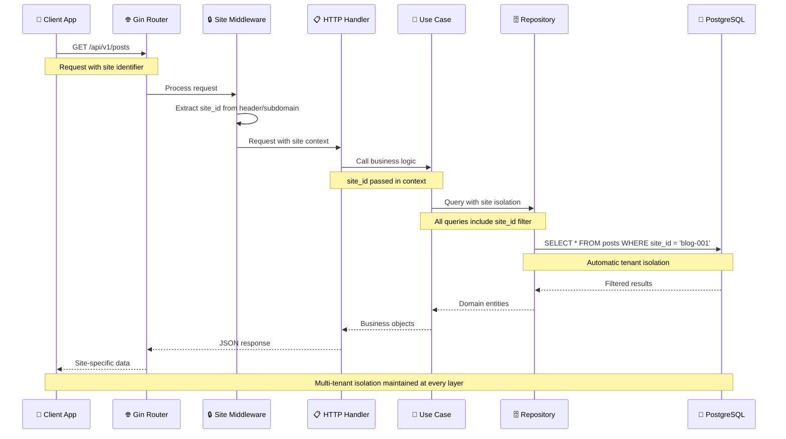
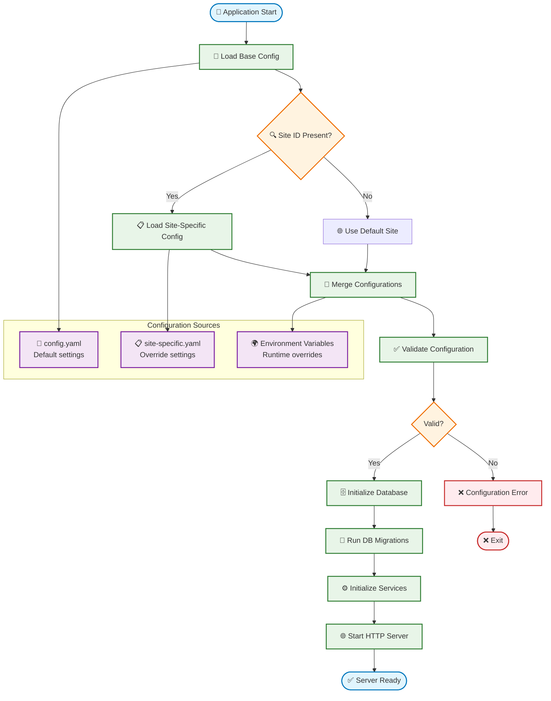
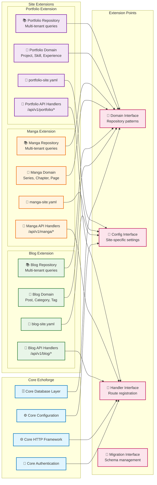
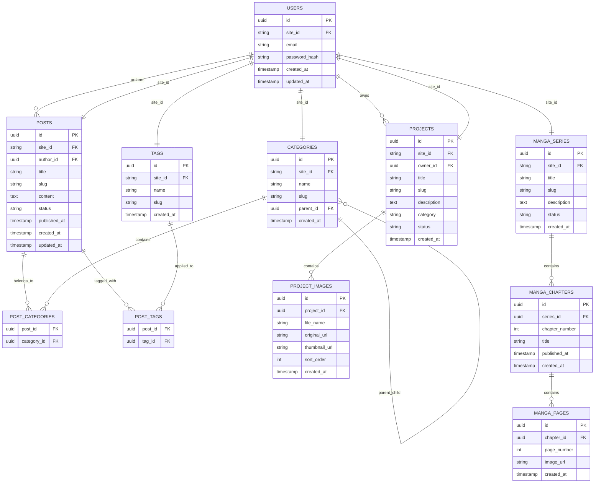
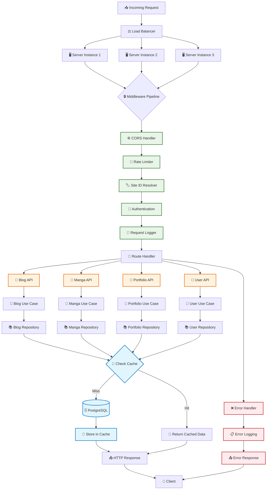

# Echoforge Architecture Diagrams

This document contains visual representations of Echoforge's architecture using Mermaid diagrams to help developers understand the system structure and data flow.

## Hexagonal Architecture Overview

The following diagram illustrates Echoforge's hexagonal (ports and adapters) architecture pattern:

```mermaid
graph TB
    subgraph "External Actors"
        User[👤 User/Client]
        DB[(🗄️ PostgreSQL Database)]
        Cache[(🔄 Redis Cache)]
        FileStorage[📁 File Storage]
        EmailService[📧 Email Service]
        Analytics[📊 Analytics Service]
    end
    
    subgraph "Adapters Layer (Infrastructure)"
        subgraph "Inbound Adapters"
            HTTPAdapter[🌐 HTTP/REST Adapter<br/>Gin Router]
            GraphQLAdapter[📊 GraphQL Adapter]
            CLIAdapter[💻 CLI Adapter]
        end
        
        subgraph "Outbound Adapters"
            DatabaseAdapter[🗄️ Database Adapter<br/>GORM Repository]
            CacheAdapter[🔄 Cache Adapter<br/>Redis Client]
            StorageAdapter[📁 Storage Adapter<br/>S3/Local Files]
            EmailAdapter[📧 Email Adapter<br/>SMTP Client]
            AnalyticsAdapter[📊 Analytics Adapter<br/>External APIs]
        end
    end
    
    subgraph "Core Domain (Business Logic)"
        subgraph "Application Layer"
            UserUseCase[👤 User Use Cases<br/>Registration, Authentication]
            PostUseCase[📝 Post Use Cases<br/>CRUD, Publishing]
            ConfigUseCase[⚙️ Config Use Cases<br/>Site Management]
            AuthUseCase[🔐 Auth Use Cases<br/>JWT, Sessions]
        end
        
        subgraph "Domain Layer"
            UserEntity[👤 User Entity<br/>ID, Email, Profile]
            PostEntity[📝 Post Entity<br/>Title, Content, Metadata]
            ConfigEntity[⚙️ Config Entity<br/>Site Settings]
            AuthEntity[🔐 Auth Entity<br/>Tokens, Permissions]
        end
        
        subgraph "Ports (Interfaces)"
            UserPort[👤 User Repository Port]
            PostPort[📝 Post Repository Port]
            ConfigPort[⚙️ Config Repository Port]
            CachePort[🔄 Cache Port]
            StoragePort[📁 Storage Port]
            EmailPort[📧 Email Port]
        end
    end
    
    %% Connections
    User --> HTTPAdapter
    User --> GraphQLAdapter
    User --> CLIAdapter
    
    HTTPAdapter --> UserUseCase
    HTTPAdapter --> PostUseCase
    HTTPAdapter --> ConfigUseCase
    HTTPAdapter --> AuthUseCase
    
    GraphQLAdapter --> UserUseCase
    GraphQLAdapter --> PostUseCase
    
    CLIAdapter --> ConfigUseCase
    
    UserUseCase --> UserEntity
    PostUseCase --> PostEntity
    ConfigUseCase --> ConfigEntity
    AuthUseCase --> AuthEntity
    
    UserUseCase --> UserPort
    PostUseCase --> PostPort
    ConfigUseCase --> ConfigPort
    UserUseCase --> CachePort
    PostUseCase --> StoragePort
    AuthUseCase --> EmailPort
    
    UserPort --> DatabaseAdapter
    PostPort --> DatabaseAdapter
    ConfigPort --> DatabaseAdapter
    CachePort --> CacheAdapter
    StoragePort --> StorageAdapter
    EmailPort --> EmailAdapter
    
    DatabaseAdapter --> DB
    CacheAdapter --> Cache
    StorageAdapter --> FileStorage
    EmailAdapter --> EmailService
    AnalyticsAdapter --> Analytics
    
    %% Styling
    classDef external fill:#e1f5fe,stroke:#0277bd,stroke-width:2px
    classDef adapter fill:#f3e5f5,stroke:#7b1fa2,stroke-width:2px
    classDef usecase fill:#e8f5e8,stroke:#2e7d32,stroke-width:2px
    classDef entity fill:#fff3e0,stroke:#ef6c00,stroke-width:2px
    classDef port fill:#fce4ec,stroke:#c2185b,stroke-width:2px
    
    class User,DB,Cache,FileStorage,EmailService,Analytics external
    class HTTPAdapter,GraphQLAdapter,CLIAdapter,DatabaseAdapter,CacheAdapter,StorageAdapter,EmailAdapter,AnalyticsAdapter adapter
    class UserUseCase,PostUseCase,ConfigUseCase,AuthUseCase usecase
    class UserEntity,PostEntity,ConfigEntity,AuthEntity entity
    class UserPort,PostPort,ConfigPort,CachePort,StoragePort,EmailPort port
```

## Multi-Tenant Data Flow

This diagram shows how multi-tenant isolation works throughout the system:

## Configuration Management Flow

This diagram illustrates how Echoforge handles multi-site configuration:

## Site Extension Architecture

This diagram shows how new site types can be added to Echoforge:

## Database Schema Relationships

This diagram shows the multi-tenant database structure:

## Request Processing Pipeline

This diagram shows how requests flow through the system:

These diagrams provide a comprehensive visual understanding of Echoforge's architecture, showing how the hexagonal pattern enables clean separation of concerns, how multi-tenancy is maintained throughout the system, and how the platform can be extended with new site types while maintaining architectural integrity.